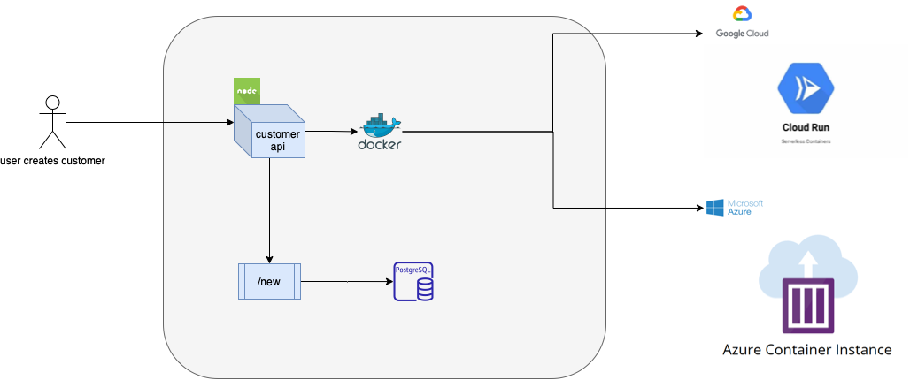
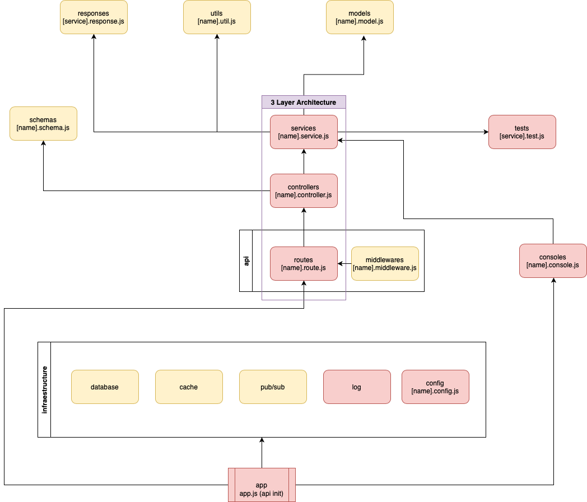

# nodejs-meetup-yapo

Building Nodejs API using a Serverless Architecture




Yapo - Building my first Nodejs API using Yapo Node Lite Skeleton and a Serverless Architecture.



## Docker using cloud proxy

1.  Install the dependencies that the project has using this command (Only first time or when re-using):
    ```
    docker-compose --file docker/docker-compose.yml run --rm njs-ms-builder-core npm install
    ```
2.  To run your project run this command:
    ```
    docker-compose --file docker/docker-compose.yml up -d
    ```
3.  To remove the docker execution run this command:
    ```
    docker-compose --file docker/docker-compose.yml down
    ```

## Docker using Makefile

To speed up the execution of commands, the use of Makefile is introduced, which has the following useful commands:

1. Install project dependecies in docker volume
   ```
   make install
   ```
2. Build images(s) of the service
   ```
   make build
   ```
3. Removing service(s)
   ```
   make down
   ```
4. Starting service(s) in background (detached) with local database
   ```
   make start
   ```
5. Restart app service in background no detached
   ```
   make restart
   ```
6. Starting service(s) using cloud proxy in background (detached)
   ```
   make start-cloud
   ```
7. Starting db service in background (detached)
   ```
   make start-db
   ```
8. Access local db instance
   ```
   make db-access
   ```
9. Load dummy data to db.
   ```
   make db-dummydata
   ```
10. Access local db instance

```
make cache-access
```

11. Starting service(s) no detached
    ```
    make up
    ```
12. Running tests located on /test
    ```
    make test
    ```
13. Running performance test located on /k6
    ```
    make load-test
    ```
14. Execute lint check over project
    ```
    make lint
    ```
15. Prune docker system
    ```
    make prune
    ```
16. For help and more commands
    ```
    make help
    ```

Make sure you have `make` installed!

## Environment variables

To modify/add configuration via environment variables, use the `.env` file, which contains basic app configuration.

## Testing the api

Unit testing:

    npm run test

Unit testing on dist build:

    npm run test_dist

Unit testing with coverage:

    npm run coverage

Unit testing on dist build with coverage:

    npm run coverage_dist
